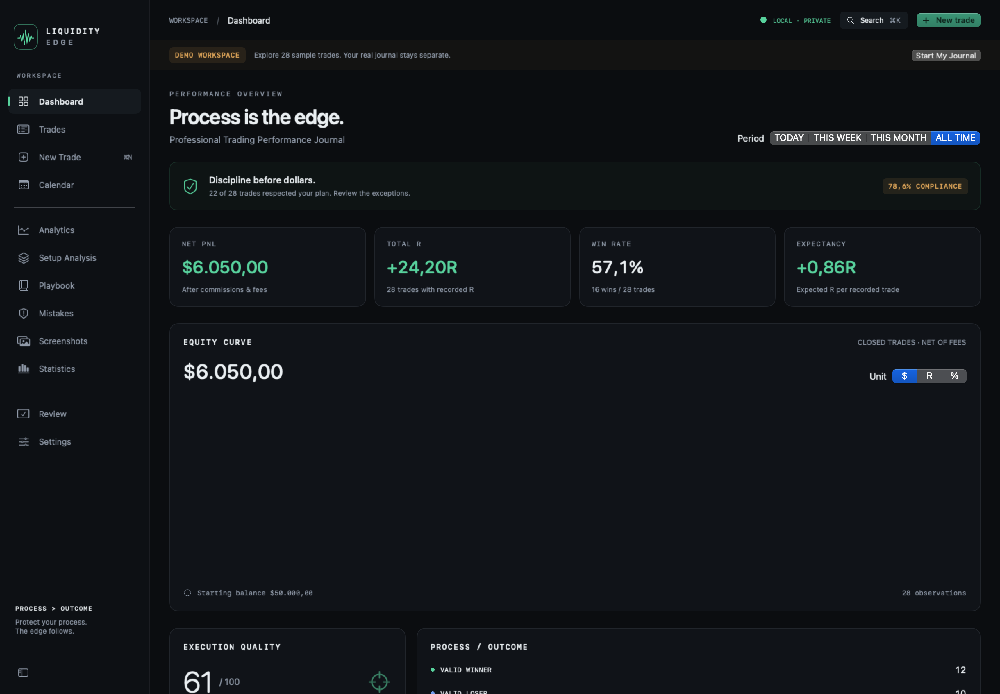

# LIQUIDITY EDGE / Trading Journal

macOS ve Windows için profesyonel çevrimdışı (offline) işlem günlüğü. İşlemler, performans analitiği, seans takvimi, strateji rehberi (playbook), canlı periyot değerlendirmeleri, görsel grafik notları ve taşınabilir JSON yedekleme.

## Kurulum Dosyaları (İndir)

| Platform | Kurulum Paketi | Gereksinimler |
| --- | --- | --- |
| Windows | [Setup.exe İndir](https://github.com/EdipMangtay/Journal/releases/download/v1.1.0-preview.1/Liquidity-Edge-Windows-Setup.exe) | Windows 10 / 11, 64-bit |
| macOS (PKG) | [PKG Kurulum Dosyası İndir](https://github.com/EdipMangtay/Journal/releases/download/v1.1.0-preview.1/Liquidity-Edge-macOS-Universal.pkg) | macOS 14+, Apple Silicon veya Intel |
| macOS (DMG) | [DMG İndir](https://github.com/EdipMangtay/Journal/releases/download/v1.1.0-preview.1/Liquidity-Edge-macOS-Universal.dmg) | Uygulamalar klasörüne sürükleyin |

Kurulum paketleri uygulamanın çalışması için gereken tüm bileşenleri içerir. Ek bir geliştirici aracı veya çalışma ortamı kurmanıza gerek yoktur. Dosyaları kaynak kodu ZIP'inden değil, **Releases** bölümünden indiriniz.

**Güvenlik bildirimi:** Önizleme paketleri açık kaynak olarak derlenmiş olup kurumsal sertifika imzası içermediğinden ilk açılışta macOS Gatekeeper veya Windows SmartScreen onay ekranı gösterebilir. Detaylar için [SIGNING.md](SIGNING.md) ve [INSTALLATION.md](INSTALLATION.md) kılavuzuna bakınız.

Yeni kurulumlar tertemiz, boş bir günlükle açılır; hiçbir demo işlem veya görsel otomatik yüklenmez. Kullanıcı kendi işlemlerini girer ve tüm veriler yerel olarak kullanıcının kendi bilgisayarında depolanır.



## Platformlar ve Özellikler

- `macos/`: Orijinal tasarımı ve performansı koruyan yerel SwiftUI / SwiftData / Swift Charts uygulaması.
- `windows/`: Özgün Mac tasarımını, renk paletini, oranlarını ve işlevlerini birebir sunan Electron masaüstü uygulaması.
- **Tam Türkçe:** Arayüz, finansal metrikler, model kuralları, filtreler ve hata bildirimleri eksiksiz Türkçe olarak hazırlanmıştır.
- **Görsel Not Düzenleyici:** Grafik ekran görüntüleri üzerinde yakınlaştırma (zoom), kaydırma (pan), ok çizimi, dikdörtgen alanı, metin ve likidite seviyesi etiketleme imkanı sunar.
- **Gizlilik ve Güvenlik:** Tamamen yerel ve çevrimdışıdır. İnternet bağlantısı, hesap kaydı ya da veri toplama/telemetri yoktur.
- **Taşınabilirlik:** Sürüm 1 uyumlu JSON yedekleme ile verilerinizi Mac ve Windows arasında istediğiniz zaman kayıpsız aktarabilirsiniz.

## Geliştirme ve Testler

### macOS
```bash
cd macos
bash Scripts/test-local.sh
bash Scripts/package-release.sh 1.1.0
```

### Windows
```powershell
cd windows
npm ci
npm test
npm run test:e2e
npm run dist:win
```

## Doğrulama

GitHub Actions iş akışı her iki platformu otomatik olarak derler, tüm yerel SwiftData ve JavaScript testlerini icra eder, Windows EXE ve macOS PKG/DMG paketlerinin kurulum ve ilk açılış testlerini başarıyla tamamlar.
